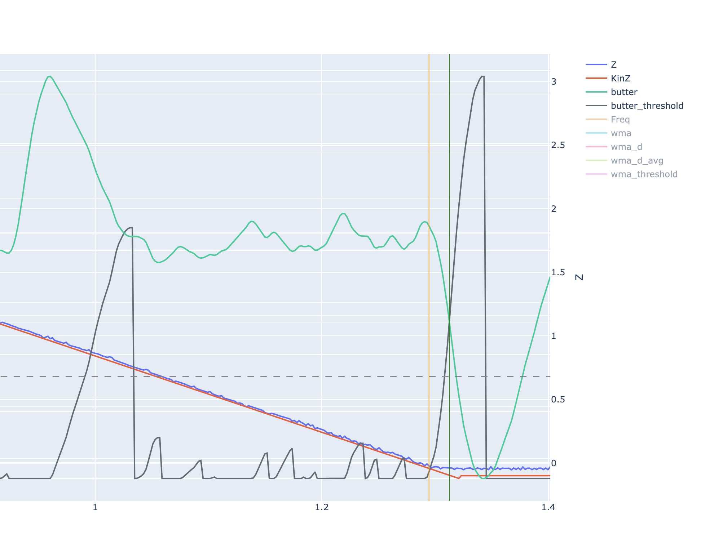

# Как читать график тапа (Tap Graph)

## Основные элементы графика

1. **Оси графика**:
   - Горизонтальная ось (X): время
   - Вертикальная ось (Y): различные измерения (высота, частота, и т.д.)

2. **Ключевые линии**:
   Z     # синяя: высота по данным датчика
   KinZ  # красная: высота по данным кинематики
   Freq  # зеленая: сырые данные частоты от датчика
   Butter # оранжевая: отфильтрованный сигнал
   Accum # фиолетовая: накопленное значение для режима WMA

## Ключевые моменты на графике

- **Начало**: обычно видны колебания (нормально)
- **Середина**: Z и KinZ должны быть близки друг к другу
- **Конец**: Z выравнивается (плато), а KinZ продолжает снижаться

## Важные линии и точки

vertical_line_1 = "начало тапа"
vertical_line_2 = "момент срабатывания тапа"
horizontal_dotted_line = "установленный порог срабатывания (threshold)"

## Интерпретация графика

1. Контакт с поверхностью: Z выравнивается, KinZ продолжает снижаться
2. Погрешность измерения: distance = abs(Z - KinZ) в конце графика
3. Качество тапа: 
   if Z_plateau and Z_close_to_KinZ and tap_trigger_near_Z_plateau:
       tap_quality = "хороший"
   else:
       tap_quality = "проблемный"

## Дополнительные линии

wma, wma_d, wma_d_avg  # используются для расчета Accum
Butter  # визуализация отфильтрованного сигнала

